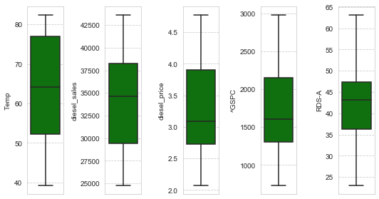
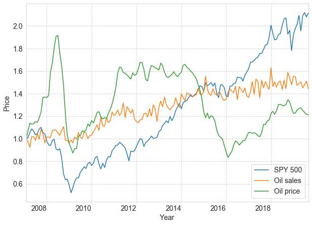
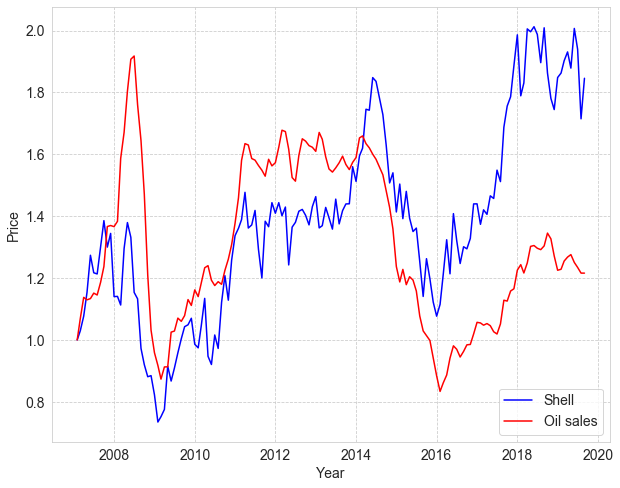
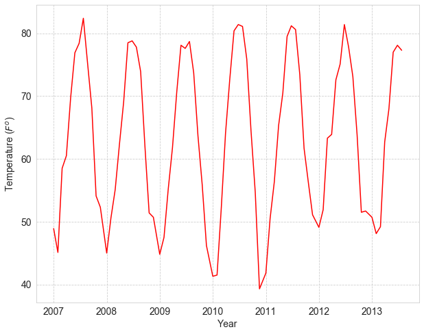
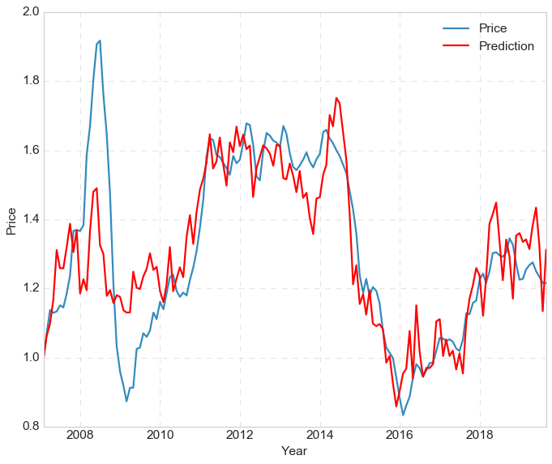
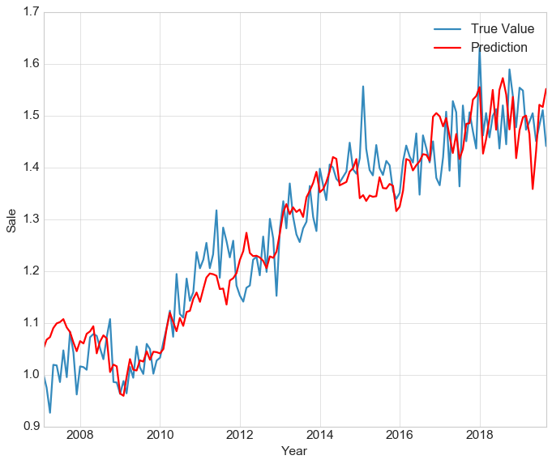

# Scrape-Yahoo-Finance-Data-for-Price-Prediction
Predictive Model for Oil Price based on SPY 500

<h>
    <strong>1. Web scraping and API</strong>
</h>

 
    we use the <a href="https://finance.yahoo.com/" target="_blank" rel="external" hreflang="en" type="text/html"> Yahoo Finance </a> as the target website to get the SPY 500 stock data. The historical oil price data US <a href="https://www.eia.gov/opendata/commands.php" target="_blank" rel="external" hreflang="en" type="text/html"> U.S Energy Information Administration </a> for the oil price. The temperature data can be found at <a href="https://sercc.com/climateinfo_files/monthly/Georgia_prcp_DivNew.htm" target="_blank" rel="external" hreflang="en" type="text/html"> Georgia Climate Center </a>.

<h> <strong>2. Data Analysis </strong> </h>

    The outlier detection has been conducted.

    

Fig. 1. The outlier detection.

    

The final data visualization of the benchmark and oil sales and price. As we can see the SPY 500 stocks and Oil prices are both lower around 2009 because of American financial crisis. Oil price also reached the down point around 2016 because of the revolution of Shale oil & gas production, and the supply exceed demand.However, the benchmark cannot give the indicator of oil supply and demand relation.

    

Fig. 2. Benchmark and sales and price.

    

 In Fig 3, the Shell or Chevron Stock can be the good indicator of supply and demand relation. As we can see the shell stock also decreased dramatically around 2016.

Fig. 3. Benchmark and sales and price.

 The monthly data from the web scraping is shown as Fig 4.The seasonality can be clearly seen in this figure. The data can be used to simulate the oil sales seasonality in terms of month. 

Fig. 4. Monthly Temperature.

<h><strong>3. Model Development</strong> </h>

we get the prediction model based on Multi-variate regression and tree model to get the final results.

<ul><strong> <li> Multi-variate regression </strong> </ul>

Fig. 5. Price Prediction.

<ul><strong> <li>Ensemble learning </strong>

Fig. 5. Price Prediction.

</ul>
<q><strong>Ensemble learning will be updated later.</strong></q>

